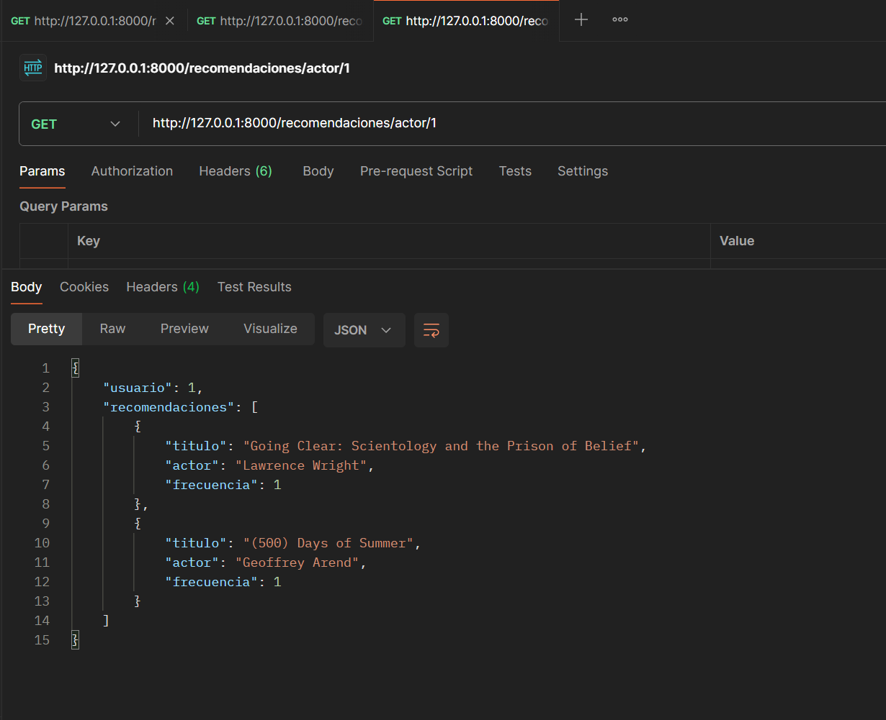
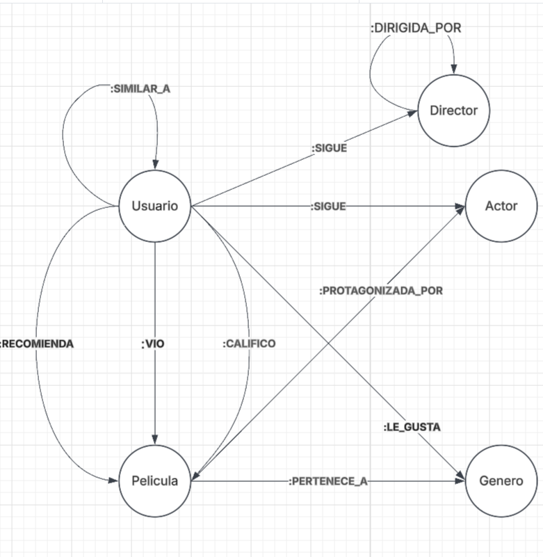

librerias:
pip install neo4j pandas

pip install fastapi uvicorn neo4j

pip install python-jose[cryptography] passlib[bcrypt] streamlit

uvicorn api_recomendaciones:app --reload

Estructura:
/proyecto_neo4j/
│── config.py          # Archivo con credenciales de conexión
│── cargar_datos.py    # Script para cargar películas a Neo4j
│── movies.csv         # Archivo de datos de películas

http://127.0.0.1:8000/recomendaciones/1

http://127.0.0.1:8000/docs#/default/recomendaciones_recomendaciones__user_id__get


📌 3. Iniciar la API con Uvicorn

Ejecuta el siguiente comando en la terminal desde la carpeta donde está api_recomendaciones.py:

    uvicorn api_recomendaciones:app --reload


    python -m uvicorn api_recomendaciones:app --reload





Diagrama del modelo



link del diagrama

[https://lucid.app/lucidchart/07873284-5a53-41a1-b551-d6d6c4c76f24/edit?viewport_loc=-125%2C-140%2C1935%2C939%2C0_0&amp;invitationId=inv_552cd5b2-f40e-4f79-afe3-8b6aaf990ace](https://lucid.app/lucidchart/07873284-5a53-41a1-b551-d6d6c4c76f24/edit?viewport_loc=-125%2C-140%2C1935%2C939%2C0_0&invitationId=inv_552cd5b2-f40e-4f79-afe3-8b6aaf990ace "https://lucid.app/lucidchart/07873284-5a53-41a1-b551-d6d6c4c76f24/edit?viewport_loc=-125%2C-140%2C1935%2C939%2C0_0&amp;invitationId=inv_552cd5b2-f40e-4f79-afe3-8b6aaf990ace")

# 📌 API de Recomendaciones con Neo4j y FastAPI

## 📌 Requisitos Previos

Asegúrate de tener instaladas las siguientes herramientas en tu sistema:

* [Python 3.9+](https://www.python.org/downloads/)
* [Neo4j Desktop o Neo4j Aura](https://neo4j.com/download/)
* [Postman](https://www.postman.com/downloads/) (Opcional para probar la API)

---

## 📌 Instalación de Dependencias

Ejecuta el siguiente comando en la terminal dentro del proyecto para instalar las librerías necesarias:

```bash
pip install -r requirements.txt
```

Si el archivo `requirements.txt` no está presente, instala manualmente las librerías necesarias:

```bash
pip install fastapi uvicorn neo4j python-dotenv bcrypt passlib python-multipart
```

---

## 📌 Configuración de la Base de Datos en Neo4j

1. **Inicia Neo4j Desktop o Neo4j Aura**
2. **Crea una nueva base de datos**
3. **Obtén las credenciales de conexión:**
   * URI: `bolt://localhost:7687` (si usas Neo4j Desktop)
   * Usuario: `neo4j`
   * Contraseña: `your_password`
4. **Guarda las credenciales en el archivo** `config.py`:

```python
# config.py
URI = "bolt://localhost:7687"
USER = "neo4j"
PASSWORD = "your_password"
```

---

## 📌 Carga de Datos a Neo4j

Para poblar la base de datos con usuarios, películas, actores y relaciones, ejecuta:

```bash
python cargar_datos.py
```

Ejecutar este comando conectará Neo4j y cargará los datos iniciales en la base de datos. Además, asegúrate de ejecutar los archivos 

`(1) llenar_datos_aleatorios.py` y `(2) crear_usuarios_y_relaciones.py` 

si es necesario para completar la carga de datos y la creación de relaciones.

Para  rellenar los nodos de generos, actores, 

```
python llenar_datos_aleatorios.py
```

Crear usuarios aleatorios y relacionar con peliculas

```
python crear_usuarios_relaciones.py
```

---


## 📌 Ejecución de la API

Para iniciar el servidor FastAPI, ejecuta:

```bash
uvicorn api_recomendaciones:app --reload
```

Esto iniciará la API en `http://127.0.0.1:8000`

---


## 📌 Ejecución del FrontEnd
Para iniciar el servidor del FrontEnd, ejecuta:

```bash
cd streamlit
```
```bash
streamlit run app.py
```

Esto iniciará el FrontEnd en `http://127.0.0.1:8501`

---


## 📌 Documentación de la API

FastAPI genera documentación automática en Swagger y Redoc:

* **Swagger UI** : [http://127.0.0.1:8000/docs](http://127.0.0.1:8000/docs)
* **Redoc** : [http://127.0.0.1:8000/redoc](http://127.0.0.1:8000/redoc)

---

## 📌 Uso de la API en Postman

### 🔹 Obtener recomendaciones para un usuario

**Método:** `GET`

```http
http://127.0.0.1:8000/recomendaciones/{user_id}
```

📌 **Ejemplo:**

```http
http://127.0.0.1:8000/recomendaciones/1
```

📌 **Respuesta:**

```json
{
    "usuario": 1,
    "recomendaciones": [
        {"titulo": "Mad Max", "frecuencia": 3},
        {"titulo": "Inception", "frecuencia": 2}
    ]
}
```

### 🔹 Obtener recomendaciones por género

**Método:** `GET`

```http
http://127.0.0.1:8000/recomendaciones/genero/{user_id}
```

📌 **Ejemplo:**

```http
http://127.0.0.1:8000/recomendaciones/genero/1
```

📌 **Respuesta:**

```json
{
    "usuario": 1,
    "recomendaciones": [
        {"titulo": "The Matrix", "genero": "Sci-Fi"},
        {"titulo": "Interstellar", "genero": "Sci-Fi"}
    ]
}
```

### 🔹 Obtener recomendaciones por actor

**Método:** `GET`

```http
http://127.0.0.1:8000/recomendaciones/actor/{user_id}
```

📌 **Ejemplo:**

```http
http://127.0.0.1:8000/recomendaciones/actor/1
```

📌 **Respuesta:**

```json
{
    "usuario": 1,
    "recomendaciones": [
        {"titulo": "Titanic", "actor": "Leonardo DiCaprio"},
        {"titulo": "Inception", "actor": "Leonardo DiCaprio"}
    ]
}
```

---

## 📌 Notas Finales

* Si hay algún error de conexión con Neo4j, verifica que la base de datos esté corriendo.
* Si FastAPI no inicia correctamente, revisa el archivo `config.py`.
* Para probar autenticación (si aplica), revisa los encabezados en Postman.

🚀 **¡Tu API de Recomendaciones está lista para usarse!** 🚀
